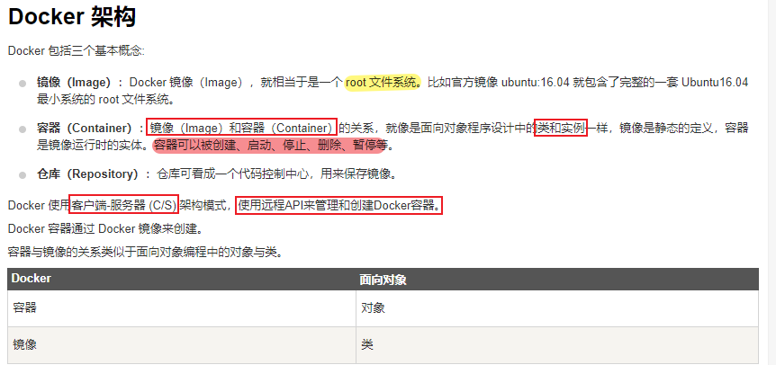

# yolt

[TOC]

https://github.com/avanetten?tab=repositories yolt v4 v2; 

1. OneNote中有yolt yolov2那篇文章的翻译。

2. 关于paper细读，在onedrive《目标检测与跟踪 资料整理.docx》中

### YOLT paper阅读精要

### 2. YOLT4环境搭建和配置

YOLTv4 构建为在支持 GPU 的机器上的 docker 容器内执行。docker 命令使用 CUDA 9.2、python 3.6 和 conda 创建一个 Ubuntu 16.04 映像。

##### Docker介绍

- 来源：https://www.runoob.com/docker/docker-architecture.html

Docker 是一个开源的应用容器引擎，基于 [Go 语言](https://www.runoob.com/go/go-tutorial.html) 并遵从 Apache2.0 协议开源。

Docker 可以让==开发者打包==他们的应用以及依赖包到一个==轻量级、可移植的容器==中，然后发布到任何流行的 Linux 机器上，也可以实现虚拟化。
容器是完全使用==沙箱机制==，相互之间不会有任何接口（类似 iPhone 的 app）,更重要的是==容器性能开销极低==。

- https://blog.csdn.net/submarineas/article/details/108477031 docker学习笔记（9）：nvidia-docker安装、部署与使用
- https://blog.csdn.net/BigData_Mining/article/details/99681168?utm_medium=distribute.pc_relevant.none-task-blog-2%7Edefault%7EBlogCommendFromMachineLearnPai2%7Edefault-3.control&depth_1-utm_source=distribute.pc_relevant.none-task-blog-2%7Edefault%7EBlogCommendFromMachineLearnPai2%7Edefault-3.control Ubuntu18.04安装nvidia-docker（亲测有效，步骤详尽）
- 可以回去在笔记本上试一下，看下可行性！

